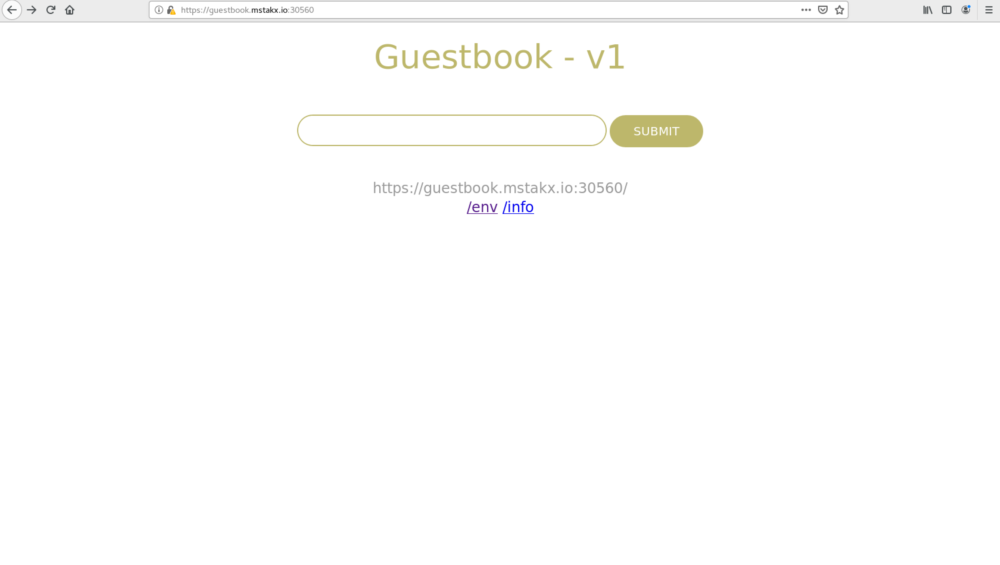

## Guestbook Example

This example shows how to build a simple multi-tier web application using Kubernetes and Docker. The application consists of a web front end, Redis master for storage, and replicated set of Redis slaves, all for which we will create Kubernetes replication controllers, pods, and services.

### Prerequisites

This example assumes that you have a working cluster. See the [Getting Started Guides](https://kubernetes.io/docs/setup/) for details about creating a cluster.

**Tip:** View all the `kubectl` commands, including their options and descriptions in the [kubectl CLI reference](https://kubernetes.io/docs/user-guide/kubectl-overview/).

All of the commands specified should be run from this directory.

### Build the multi-tier Guestbook application as below

Apply the resources by running the following command:

```console
$ kubectl apply -f production_namespace.yaml
namespace/production created
$ kubectl apply -f production-guestbook-all-deploy.yaml -n production
deployment.apps/redis-master created
service/redis-master created
deployment.apps/redis-slave created
deployment.apps/guestbook-v1 created
secret/production-guestbook created
service/guestbook created
ingress.extensions/guestbook created
```

2. To verify that the guestbook service is up, list the objects you created in the cluster with the below command:

    ```console
    root@master:~/mstakx/guestbook_deployment# kubectl get all -n production
    NAME                                READY   STATUS    RESTARTS   AGE
    pod/guestbook-v1-6cb588d958-5sqmk   1/1     Running   0          25s
    pod/guestbook-v1-6cb588d958-7kvk8   1/1     Running   0          25s
    pod/guestbook-v1-6cb588d958-lw9fd   1/1     Running   0          25s
    pod/redis-master-58c99d6fd4-htp9l   1/1     Running   0          25s
    pod/redis-slave-86d554c866-5jxtq    1/1     Running   0          25s
    pod/redis-slave-86d554c866-c97z5    1/1     Running   0          25s


    NAME                   TYPE        CLUSTER-IP       EXTERNAL-IP   PORT(S)    AGE
    service/guestbook      ClusterIP   10.100.134.127   <none>        3000/TCP   25s
    service/redis-master   ClusterIP   10.111.210.146   <none>        6379/TCP   25s
    service/redis-slave    ClusterIP   10.110.1.0      <none>        6379/TCP   87s
    NAME                           READY   UP-TO-DATE   AVAILABLE   AGE
    deployment.apps/guestbook-v1   3/3     3            3           25s
    deployment.apps/redis-master   1/1     1            1           25s
    deployment.apps/redis-slave    2/2     2            2           25s

    NAME                                      DESIRED   CURRENT   READY   AGE
    replicaset.apps/guestbook-v1-6cb588d958   3         3         3       25s
    replicaset.apps/redis-master-58c99d6fd4   1         1         1       25s
    replicaset.apps/redis-slave-86d554c866    2         2         2       25s


    root@master:~/mstakx/guestbook_deployment# kubectl get secret,ingress -n production
    NAME                          TYPE                                  DATA   AGE
    secret/default-token-9tnv9    kubernetes.io/service-account-token   3      95s
    secret/production-guestbook   Opaque                                2      74s

    NAME                           HOSTS                 ADDRESS   PORTS     AGE
    ingress.extensions/guestbook   guestbook.mstakx.io             80, 443   74s
    root@master:~/mstakx/guestbook_deployment#
    ```
    
Result: The guestbook displays in your browser:



### Autoscaling has been configured for the fronend guestbook deployment.
  To test the autoscaling functionality, execute below
  
  ```
    $kubectl apply -f production-load-generator-job.yaml
  
    (or)
    $kubectl apply -f staging-load-generator-job.yaml
  
    $kubectl get hpa -n production
    NAME           REFERENCE                 TARGETS   MINPODS   MAXPODS   REPLICAS   AGE
    guestbook-v1   Deployment/guestbook-v1   167%/30%    1         10        5          90m
    ```
