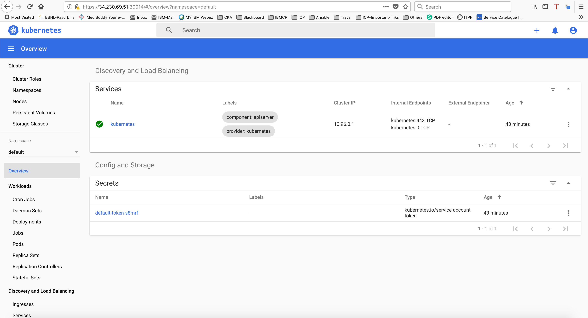

# k8s-install
Single master kubeadm installation on AWS ubuntu 16.04 Instance

### Prerequisites

1) This example assumes that you have 1 Ansible, 1 Master and N no of worker node( Min 2 is recommended) with min 2CPU X 4 GBRAM servers.Here I have used t2.xlarge(4cpuX16 GBRAM) AWS instance with ubuntu-16.04Lts for better performance and additonal applicaton deployment.See the [k8s installation doc.](https://kubernetes.io/docs/setup/production-environment/tools/kubeadm/create-cluster-kubeadm/) for details about creating a cluster.
2) Install ansible package on Ansible node. See the [Ansible installation on ubuntu server](https://docs.ansible.com/ansible/latest/installation_guide/intro_installation.html#latest-releases-via-apt-ubuntu) 

### Install k8s

Use the `kubernetes-install.yaml` file to create a single control-plane cluster with kubeadm.

1. Before executing the ansible playbook, we need to update the Nodes IP address and sudo username and Pem key for authentication on the host file as example below.

    ```
    [allservers]
    master 34.230.69.51 ansible_ssh_user=ubuntu
    worker1 54.237.234.166 ansible_ssh_user=ubuntu
    worker2 3.89.84.249 ansible_ssh_user=ubuntu

    [masternode]
    master 34.230.69.51 ansible_ssh_user=ubuntu

    [workernode]
    worker1 54.237.234.166 ansible_ssh_user=ubuntu
    worker2 3.89.84.249 ansible_ssh_user=ubuntu

    [allservers:vars]
    ansible_user=ubuntu
    ansible_ssh_private_key_file=/etc/ansible/myawskey.pem
    ```

2. Use the `kubernetes-install.yaml` to create a cluster. Which will initiate the master node, then its will automatically initiate the worker node and join on the cluster. Once kubernetes cluster Up and running, its automatically configure the kubernetes dashboard and provided the login token.

    ```console
    $ ansible-playbook kubernetes-install.yaml
    .
    .
    .
    TASK [kube-dashboard : debug] **************************************************
    ok: [34.230.69.51] => {
    "token.stdout_lines": [
        "Name:         admin-user-token-xj42z", 
        "Namespace:    kubernetes-dashboard", 
        "Labels:       <none>", 
        "Annotations:  kubernetes.io/service-account.name: admin-user", 
        "              kubernetes.io/service-account.uid: 23d839bb-dd88-4ad6-a3f6-fc1973ba05d3", 
        "", 
        "Type:  kubernetes.io/service-account-token", 
        "", 
        "Data", 
        "====", 
        "ca.crt:     1025 bytes", 
        "namespace:  20 bytes", 
        "token:      eyJhbGciOiJSUzI1NiIsImtpZCI6IiJ9.eyJpc3MiOiJrdWJlcm5ldGVzL3NlcnZpY2VhY2NvdW50Iiwia3ViZXJuZXRlcy5pby9zZXJ2aWNlYWNjb3VudC9uYW1lc3BhY2UiOiJrdWJlcm5ldGVzLWRhc2hib2FyZCIsImt1YmVybmV0ZXMuaW8vc2VydmljZWFjY291bnQvc2VjcmV0Lm5hbWUiOiJhZG1pbi11c2VyLXRva2VuLXhqNDJ6Iiwia3ViZXJuZXRlcy5pby9zZXJ2aWNlYWNjb3VudC9zZXJ2aWNlLWFjY291bnQubmFtZSI6ImFkbWluLXVzZXIiLCJrdWJlcm5ldGVzLmlvL3NlcnZpY2VhY2NvdW50L3NlcnZpY2UtYWNjb3VudC51aWQiOiIyM2Q4MzliYi1kZDg4LTRhZDYtYTNmNi1mYzE5NzNiYTA1ZDMiLCJzdWIiOiJzeXN0ZW06c2VydmljZWFjY291bnQ6a3ViZXJuZXRlcy1kYXNoYm9hcmQ6YWRtaW4tdXNlciJ9.S_04dwa_E49GGhRQAa4of6WOTkPTR-y2AmNkDfbhk0WH6LloPqvCZHii-mIafpzWkOeACu4NGT7CcF-xaLdiTSoG--sbFxi8qkPzsRszTOtgYKokakYpWpLs4z9f2GCA8b1FNTe4TQi2J5ATUeqTiTf-kNy1QYjSxKOdPGU7LygfmbUnv2e_wCVFL8j8Gk76wPHpTLMYDqBtPwWJdS8lbqOZPDzpMNsYGEs878djPm1VgtLqlKL2dJv99WCBrz3vT-z_d1AquUBuXjBpe4HTnl_77XLxOQCod94lC1xr8QR-p6R3H3_pC5C75VUCPOl89ZIkrN-epOOjxAAKKv95yw"
    ]
    }

    TASK [kube-dashboard : Fetching the dashboard IP & Port] ***********************
    changed: [34.230.69.51]

    TASK [kube-dashboard : Access the dasboard with below IP:Port] *****************
    changed: [34.230.69.51]

    TASK [kube-dashboard : debug] **************************************************
    ok: [34.230.69.51] => {
    "dashboard.stdout_lines": [
        "https://:34.230.69.51:30014"
    ]
    }

    PLAY RECAP *********************************************************************
    3.89.84.249                : ok=15   changed=3    unreachable=0    failed=0   
    34.230.69.51               : ok=44   changed=19   unreachable=0    failed=0   
    54.237.234.166             : ok=15   changed=3    unreachable=0    failed=0   

    ```

    Result: Ansible deployment creates a kubernetes cluster.


### To access the kubernetes dashboard

You can access the kubernetes dashboard using https://:34.230.69.51:30014 with token method. login token will dispaly at last of ansible execution.


    ```console
           "token:      eyJhbGciOiJSUzI1NiIsImtpZCI6IiJ9.eyJpc3MiOiJrdWJlcm5ldGVzL3NlcnZpY2VhY2NvdW50Iiwia3ViZXJuZXRlcy5pby9zZXJ2aWNlYWNjb3VudC9uYW1lc3BhY2UiOiJrdWJlcm5ldGVzLWRhc2hib2FyZCIsImt1YmVybmV0ZXMuaW8vc2VydmljZWFjY291bnQvc2VjcmV0Lm5hbWUiOiJhZG1pbi11c2VyLXRva2VuLXhqNDJ6Iiwia3ViZXJuZXRlcy5pby9zZXJ2aWNlYWNjb3VudC9zZXJ2aWNlLWFjY291bnQubmFtZSI6ImFkbWluLXVzZXIiLCJrdWJlcm5ldGVzLmlvL3NlcnZpY2VhY2NvdW50L3NlcnZpY2UtYWNjb3VudC51aWQiOiIyM2Q4MzliYi1kZDg4LTRhZDYtYTNmNi1mYzE5NzNiYTA1ZDMiLCJzdWIiOiJzeXN0ZW06c2VydmljZWFjY291bnQ6a3ViZXJuZXRlcy1kYXNoYm9hcmQ6YWRtaW4tdXNlciJ9.S_04dwa_E49GGhRQAa4of6WOTkPTR-y2AmNkDfbhk0WH6LloPqvCZHii-mIafpzWkOeACu4NGT7CcF-xaLdiTSoG--sbFxi8qkPzsRszTOtgYKokakYpWpLs4z9f2GCA8b1FNTe4TQi2J5ATUeqTiTf-kNy1QYjSxKOdPGU7LygfmbUnv2e_wCVFL8j8Gk76wPHpTLMYDqBtPwWJdS8lbqOZPDzpMNsYGEs878djPm1VgtLqlKL2dJv99WCBrz3vT-z_d1AquUBuXjBpe4HTnl_77XLxOQCod94lC1xr8QR-p6R3H3_pC5C75VUCPOl89ZIkrN-epOOjxAAKKv95yw"
           
    ```
    
Result: The guestbook displays in your browser:


### Kunernetes Uninstall

In case, if you need to uninstall the k8s, execute the below command to clean the k8s installation.
    ```console
    ansible-playbook reset-k8s.yaml 
    ```
